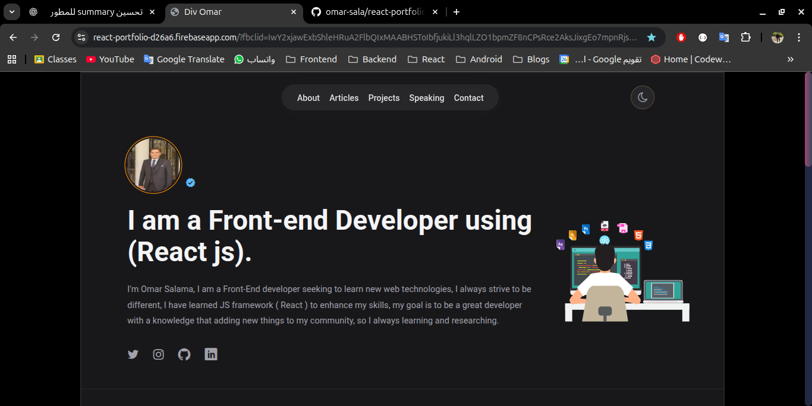
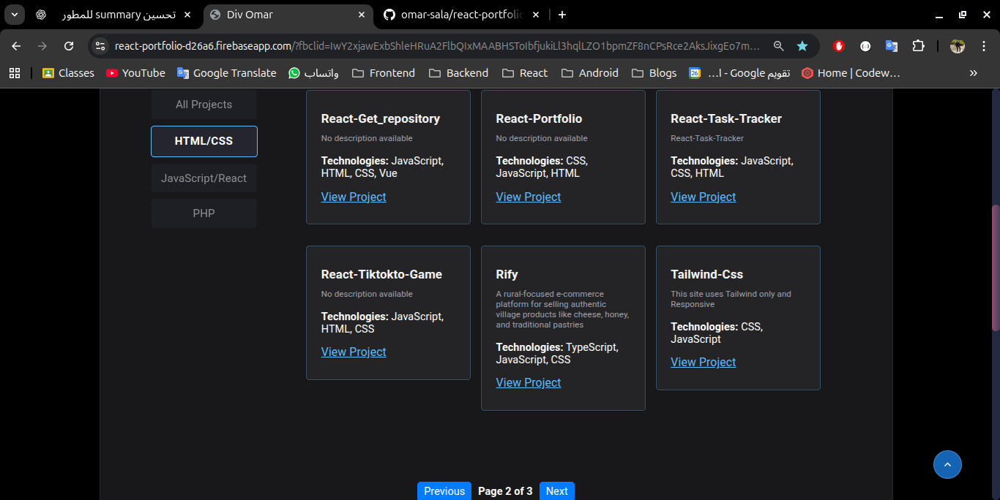
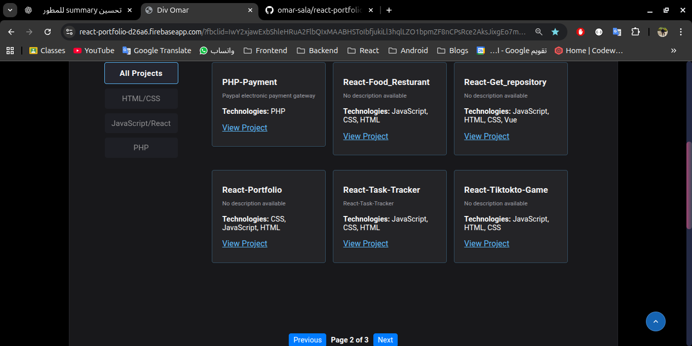
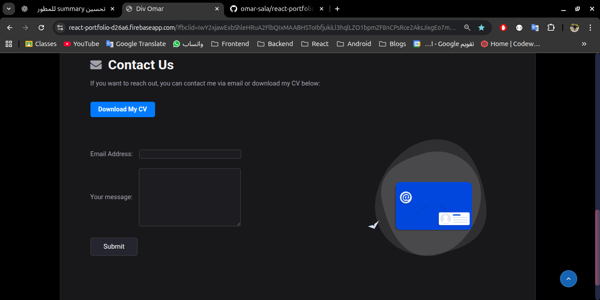

# 👨‍💻 Omar Salama | Front-End Developer Portfolio

This is my personal portfolio website, built using **React**, designed to showcase my skills, projects, and experience as a **Front-End Developer** in a modern, interactive, and user-friendly way.

The portfolio dynamically fetches projects from the **GitHub REST API** and displays them in a clean and organized layout. Visitors can filter projects to easily explore specific types of work.

The website reflects my focus on **clean UI**, **responsive design**, and **real-world front-end functionality**.

---

## 🌐 Live Demo

👉 Portfolio Website  
https://react-portfolio-d26a6.firebaseapp.com/?fbclid=IwY2xjawExbShleHRuA2FlbQIxMAABHSToIbfjukiLl3hqlLZO1bpmZF8nCPsRce2AksJixgEo7mpnRjsblSIJcw_aem_7f4BqHCvze8G4jSFiVFJfw

---

## 📸 Screenshots

  
  
  


---

## ✨ Features

- Fully responsive design (mobile, tablet, desktop)
- Clean and modern user interface
- Dynamic project fetching from GitHub API
- Project filtering for easy navigation
- Downloadable CV
- Contact form to send messages directly via email
- Dark & Light mode for better user experience
- Smooth animations and transitions
- Component-based architecture using React

---

## 🧠 Technical Highlights

- Integrated GitHub REST API to fetch repositories dynamically
- Implemented project filtering based on categories and technologies
- Built reusable and scalable React components
- Managed application state efficiently
- Implemented Dark & Light mode with persistent user preferences
- Enhanced UX with smooth animations and transitions
- Focused on clean code structure and maintainability

---

## 🛠️ Technologies Used

- **React + Vite** – Building reusable UI components
- **JavaScript (ES6+)** – Logic and interactivity
- **HTML5** – Page structure
- **CSS** – Styling and layout
- **GitHub API** – Fetching and displaying projects dynamically

---

## 🚀 Getting Started

To run this project locally:

```bash
git clone https://github.com/omar-sala/react-portfolio.git
cd react-portfolio
npm install
npm run dev
```
